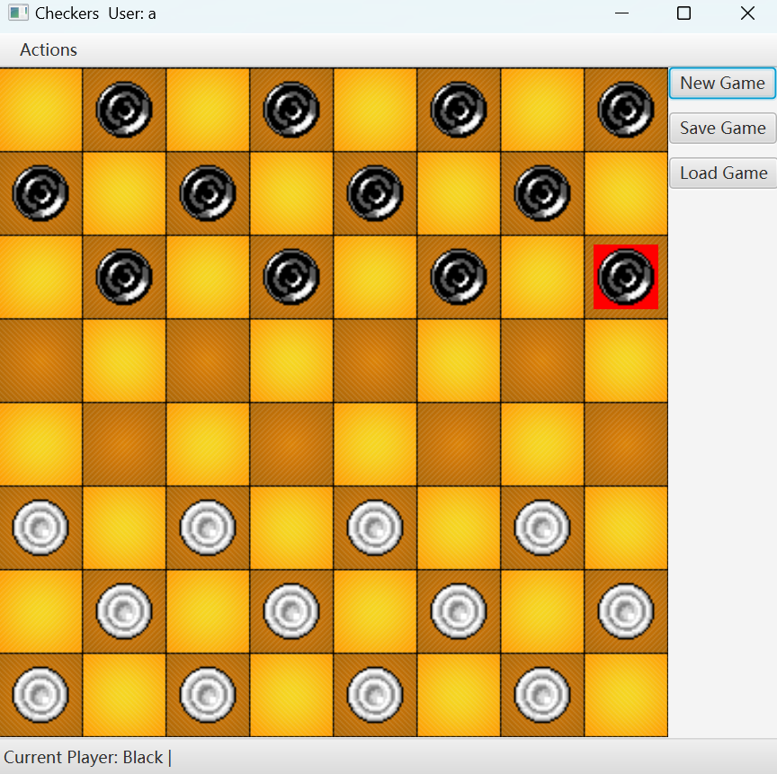

# Checkers
A Checkers game written in JavaFX

### This game has some simple rules

- Players take turns to move 1 piece at a time
- The starting player is random
- Pieces can move diagonally only
- Pieces can move 1 space 'forwards', that is away from their starting side, to the left or right, if the target space is empty
- Pieces can 'jump' one enemy piece to move 2 spaces in a straight line diagonally, IF the target space is empty
- If a piece is 'jumped' it is removed from the board
- If a 'jump' move is possible, it must be made. If multiple jump moves are possible the player can choose whichever they like
- If a jump move leaves a piece in a position where it can jump again (not necessarily in the same direction), the player must continue jumping in the same turn
- If a piece makes it to the far side of the board, it is 'crowned' as a king, and can now move diagonally both forwards and backwards, both single spaces and jump moves
- If a player is unable to move - either they have lost all their pieces or their current pieces are blocked and have no moves possible, that player loses and the game ends

### Interaction
You move a piece by clicking on a piece with a possible move, and clicking on the space to move it to. Valid pieces and moves are highlighted. To cancel a move, click the piece again. Both players are human and both players interact the same way. Keyboard shortcuts are available for the button and menu options: **Ctrl+N** for new game, **Ctrl+S** for serialise (save game), **Ctrl+L** for deserialise (load game).

Serialisation
The game features a very basic save and load system - serialising the board state to a string, and loading that string back to reset the board state to what it was when the string was generated.

# Contributing

### Current contributors
- USYD COMP9202 staff (Original code base)
- Renjie He (Code extension)

Acknowledgements:
Chess board image: https://opengameart.org/content/chess-grille  
Checkers images: https://opengameart.org/content/checkers

If you would like to make improvements to the project, please contact us for permission to contribute. Feel free to dive in!
